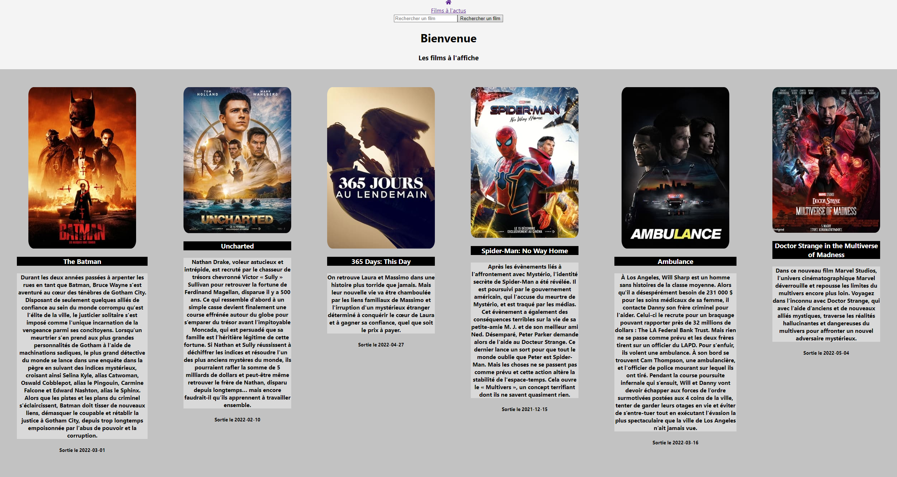
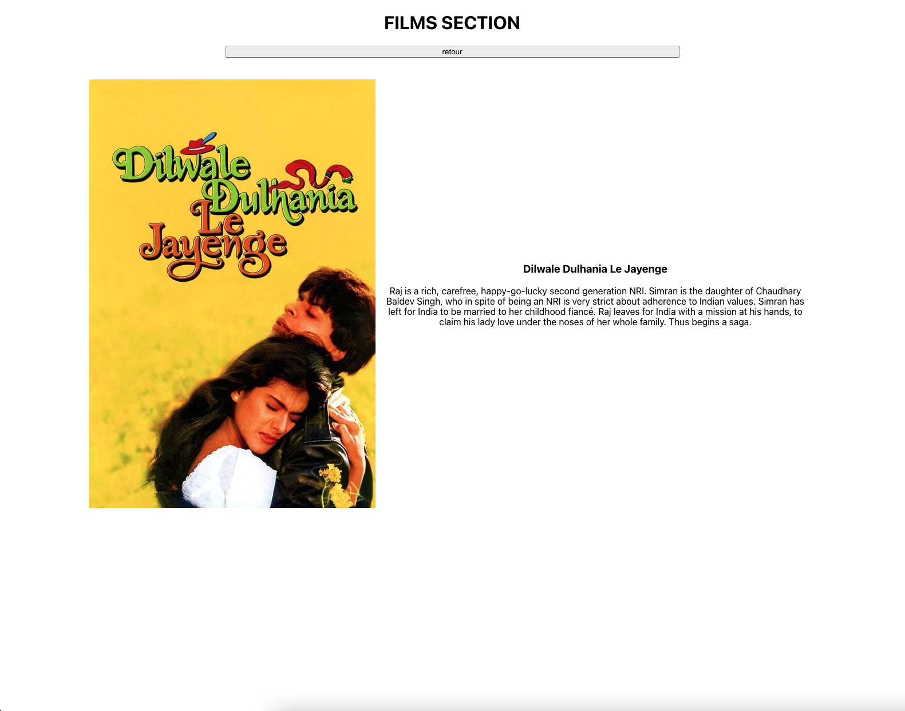
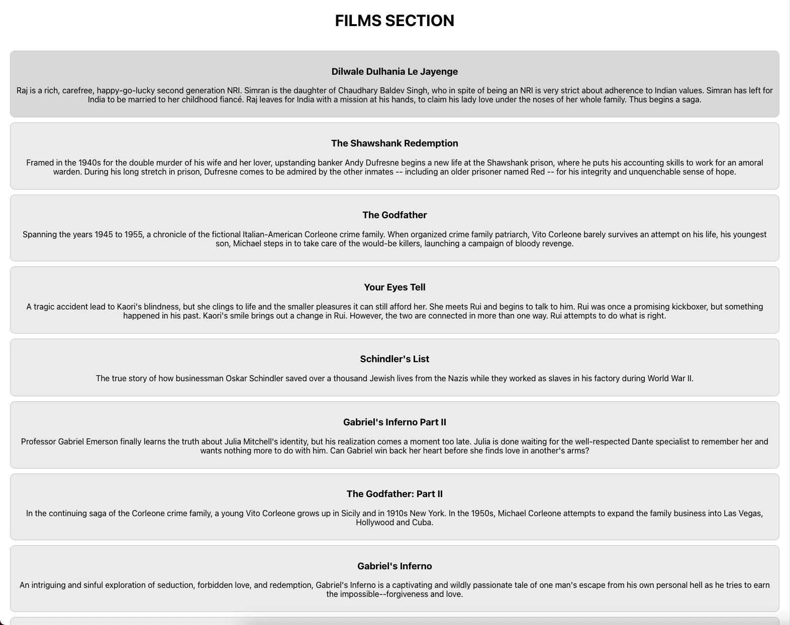

# APP-CINE-TEST!

[1]#Librairies & Frameworks utilisés

Projet sous REACT 17.0.2 ==> https://github.com/facebook/react/blob/main/CHANGELOG.md#1702-march-22-2021  
React-icons ==> https://react-icons.github.io/react-icons/  
React-Router v6  ==> https://reactrouter.com/docs/en/v6/getting-started/overview  
Redux Toolkit 1.8.0 ==> https://redux-toolkit.js.org  
React Bootstrap 2.2.3 ==> https://react-bootstrap.github.io  
AXIOS API 0.26.0 ==> https://www.npmjs.com/package/axios  

[2]#But et fonctionnement de l'app

L'idée est simple et standard il s'agit d'une application REACT utilisant l'API TheMovieDB et de simuler un site type Allociné
le but est de récupérer les datas envoyés par l'API via une instance AXIOS, de stocker ces datas dans le store Redux/Toolkit  
Puis de redistribuer ces datas, via les fonctions Redux

[3]#Exemple cible!

